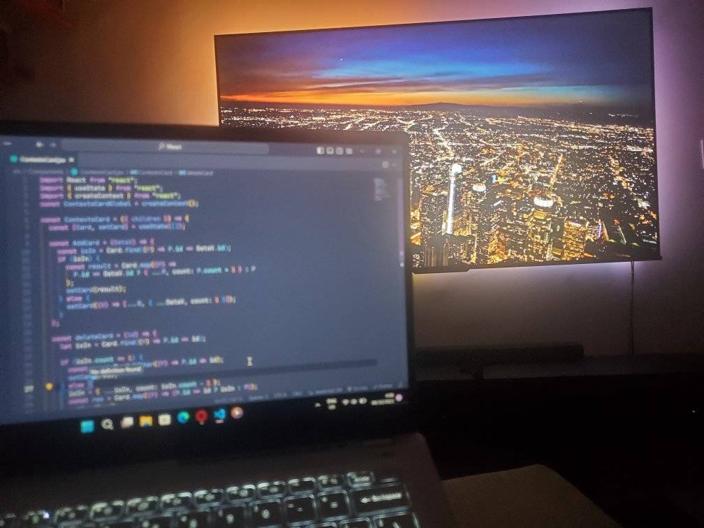

# Hola :wave:, mi nombre es Miguel Corporan
_Bienvenido seas a mi GitHub_

**Sobre mi:**

Soy un joven apasionado por el diseño web por lo que elegi el front end como mi area de especialización y ya llevo 3 años desde que inicie esta travesia y les aseguro que el viaje esta siendo emocionante, espero disfruten mis proyectos y avances.:smiley_cat:

Como datos extras tambien soy un apasionado por los juegos:video_game: y la fotografia:camera:.

# Habilidades
_Estas son algunas de mis habilades adquiridas en estos años_ :rocket:

# Formas de contactarme
_Aqui te dejare algunas de mis redes por si te interesa hablar conmigo._ :telephone_receiver:

:envelope: Mcorporan536@gmail.com

[Instagram](https://www.instagram.com/jin.dev_/)

